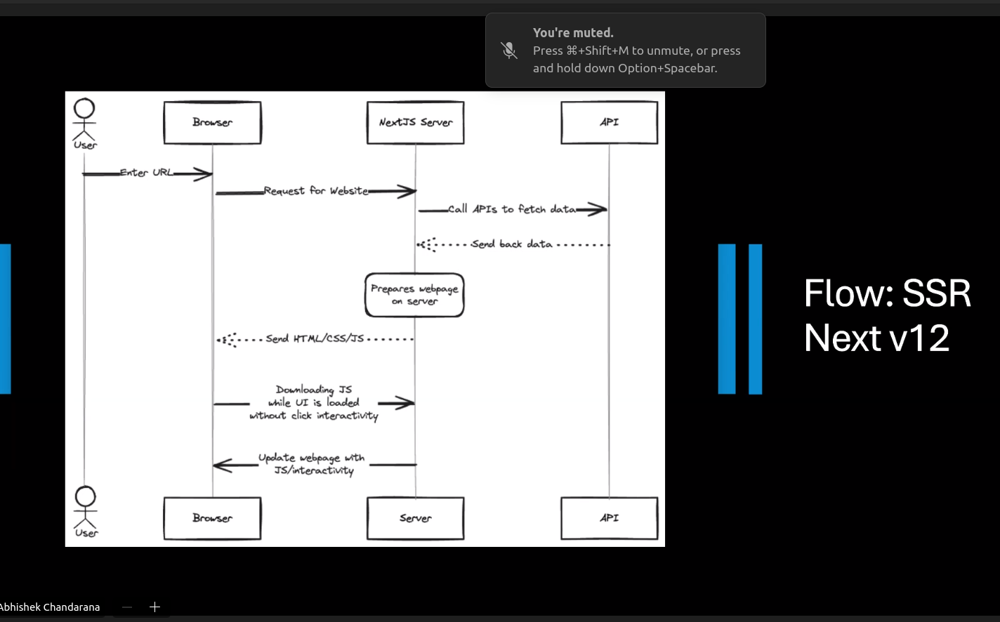

## Abhishek Chandarana Session:

  

  

  

# Codevolution Notes

[Routing Convention](#routing-convention)
[Nested dynamic routes](#nested-dynamic-routes)
[Catch-All-1](#catch-all-1)
[Catch-All-2](#catch-all-2)
[Catch-All-2-Output](#catch-all-2-output)
[Not Found](#not-found)
[Private Folder](#private-folder)
[Private Folder 1](#private-folder-1)
[Route Group](#route-group)
[Layout](#layout)
[Route Group Layout](#route-group-layout)
[MetaData](#metadata)
[Configuring MetaData](#configuring-metadata)
[title Metadata](#title-metadata)
[Template](#template)
[Layout and Template](#layout-and-template)
[Loading File](#loading-file)
[Error](#error)
[Hierarchy of Special files in a given folder](#hierarchy-of-special-files-in-a-given-folder)
[Handling errors in nested routes](#handling-errors-in-nested-routes)
[Edge case in Error For Layout](#edge-case-in-error-for-layout)
[Parallel routes](#parallel-routes)
[Parallel routes 1](#parallel-routes-1)
[This normal approach](#this-normal-approach)
[With parallel slots](#with-parallel-slots)
[Parallel Routes Benefits](#parallel-routes-benefits)
[Independent route handling](#independent-route-handling)
[Slot benefit: Independent route handling](#slot-benefit-independent-route-handling)
[Slot benefit: Sub navigation](#slot-benefit-sub-navigation)
[Unmatched Routes](#unmatched-routes)
[Intercepting routes](#intercepting-routes)
[Intercepting example](#intercepting-example)
[Intercepting route convention](#intercepting-route-convention)
[First Route handler](#first-route-handler)
[Simple post](#simple-post)
[URL Query](#url-query)
[Redirect route](#redirect-route)
[Request Headers](#request-headers)
[Response Headers](#response-headers)
[2 ways to read request headers](#2-ways-to-read-request-headers)
[Cookies](#cookies)
[2 ways to Set Cookies](#2-ways-to-set-cookies)
[Caching](#caching)
[Stop Caching](#stop-caching)
[Middleware](#middleware)
[Middleware example](#middleware-example)
[Drawbacks of SSR](#drawbacks-of-ssr)
[Solution to these DrawBacks](#solution-to-these-drawbacks)
[React Server Components (RSC)](#react-server-components-rsc)
[RSC Key Takeaways](#rsc-key-takeaways)
[RSC Loading Sequence](#rsc-loading-sequence)
[RSC Updating Sequence](#rsc-updating-sequence)
[Server Rendering Strategy](#server-rendering-strategy)
[Static Rendering](#static-rendering)
[Dynamic Rendering](#dynamic-rendering)
[Streaming](#streaming)

## Routing Convention

  

## Nested dynamic routes

  

## Catch-All-1

  

## Catch-All-2

  

## Catch-All-2-Output

  

## Not Found

  

## Private Folder

  

## Private Folder 1

  

## Route Group

  

## Layout

  

  

  

  

  

## Route Group Layout

  

## MetaData

  

## Configuring MetaData

  

## title Metadata

  

## Template

  

## Layout and Template

  

## Loading File

  

## Error

  

## Hierarchy of Special files in a given folder

  

## Handling errors in nested routes

  

## Edge case in Error For Layout

  

## Parallel routes

  

## Parallel routes 1

  

## This normal approach

  

## With parallel slots

  

## Parallel Routes Benefits

  

## Independent route handling

  

## Slot benefit: Independent route handling

  

## Slot benefit: Sub navigation

  

## Unmatched Routes

  

## Intercepting routes

  

## Intercepting example

  

## Intercepting route convention

  

## First Route handler

  

## Simple post

  

## URL Query

  

## Redirect route

  

## Request Headers

  

## Response Headers

  

## 2 ways to read request headers

  

  

  

## Cookies

  

## 2 ways to Set Cookies

  

  

## Caching

  

## Stop Caching

  

## Middleware

  

## Middleware example

  

## Drawbacks of SSR

  

  

  

## Solution to these DrawBacks

  

## React Server Components (RSC)

  

## RSC Key Takeaways

  

## RSC Loading Sequence

  

## RSC Updating Sequence

  

## Server Rendering Strategy

  

## Static Rendering

  

## Dynamic Rendering

  

## Streaming

  

